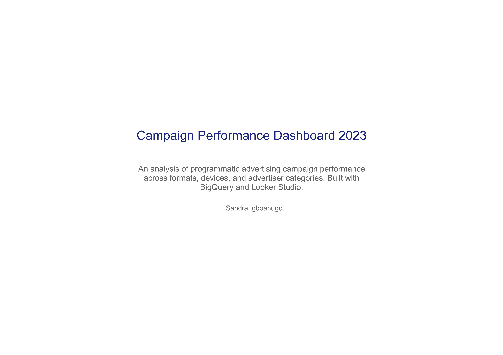
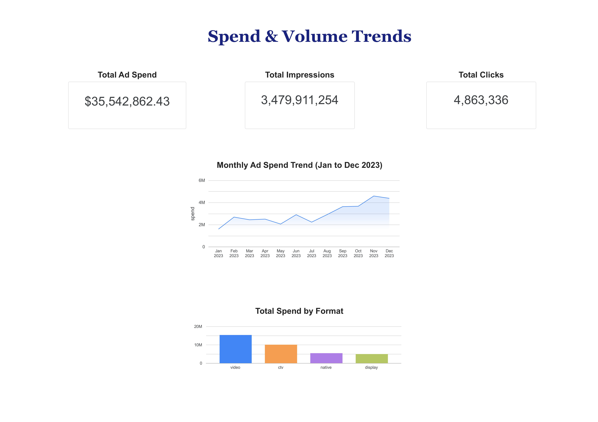
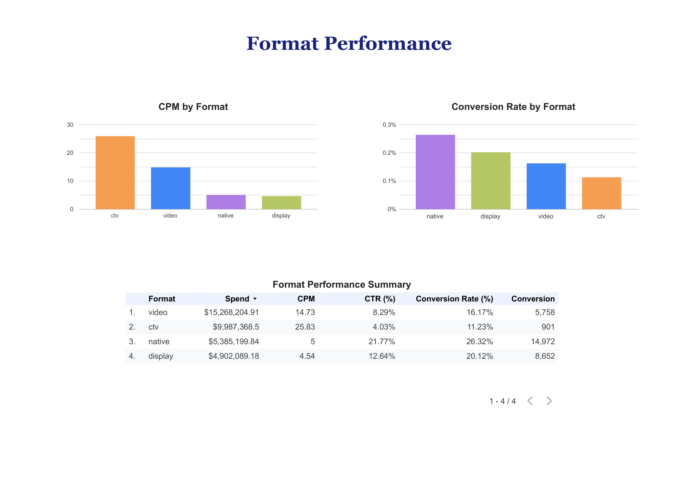
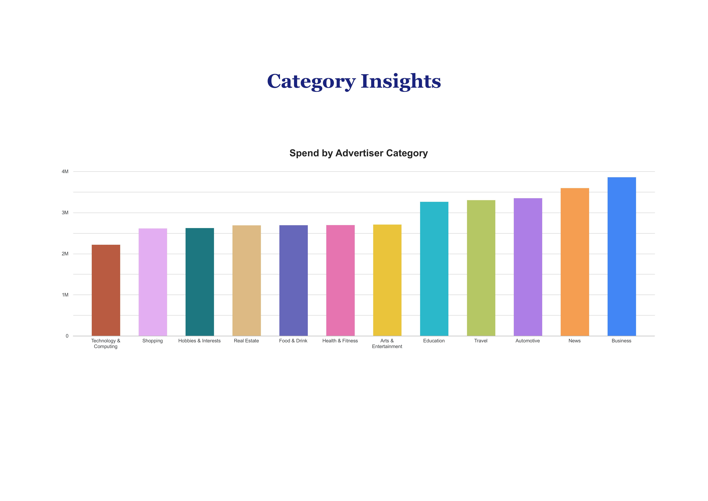
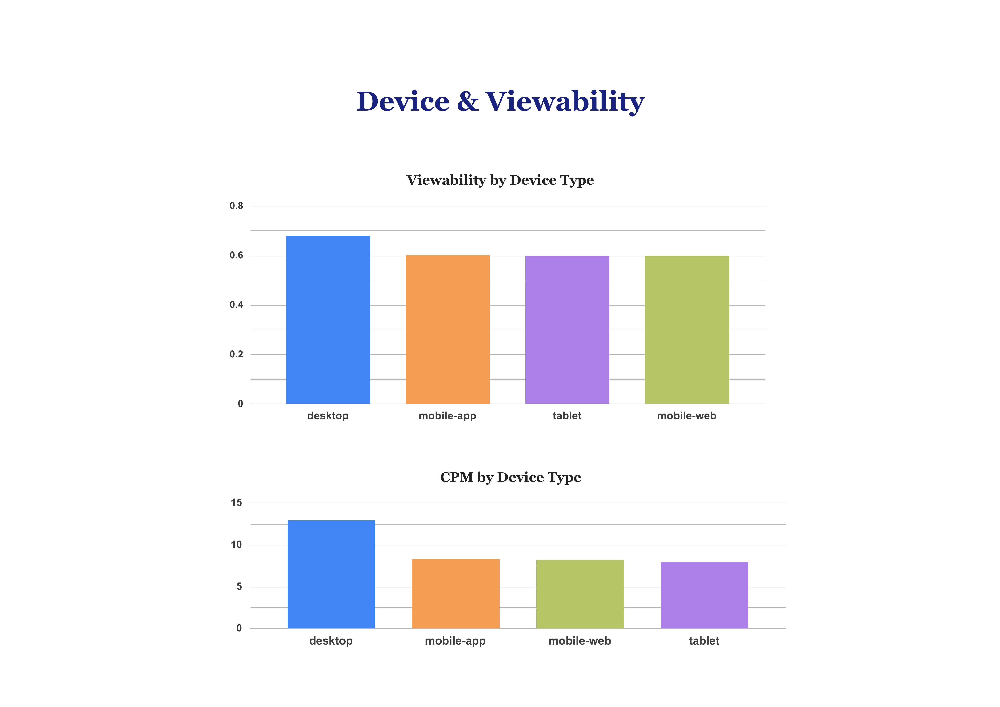

# Adtech Campaign Performance Dashboard 2023

**Tools:** BigQuery · Looker Studio · SQL · Python  
**Dataset:** 20,749 synthetic records across 1 campaign performance table  
**Scope:** Spend Analysis · Format Performance · Category Insights · Device & Viewability

---

## Project Overview

This project simulates the core responsibilities of a BI and data analyst working within a programmatic advertising environment. Using a synthetic dataset modelled on real-world demand-side platform (DSP) campaign data, the analysis covers four key reporting domains: spend and volume trends, ad format efficiency, advertiser category performance, and device-level viewability analysis.

The project demonstrates the ability to design and query data in BigQuery, build production-ready dashboards in Looker Studio, and translate raw campaign data into actionable insights — skills directly aligned with data analyst roles in adtech and digital media environments.

---

## Repository Structure

```
adtech-campaign-performance-dashboard/
│
├── adtech_campaign_performance_2023.csv         # Synthetic campaign performance dataset
├── queries.sql                                   # All BigQuery SQL queries with comments
├── Adtech_Campaign_Performance_Dashboard_2023.pdf  # Full dashboard export
├── Adtech_Campaign_Performance_Dashboard_2023_Page_1.jpg  # Overview
├── Adtech_Campaign_Performance_Dashboard_2023_Page_2.jpg  # Spend & Volume Trends
├── Adtech_Campaign_Performance_Dashboard_2023_Page_3.jpg  # Format Performance
├── Adtech_Campaign_Performance_Dashboard_2023_Page_4.jpg  # Category Insights
├── Adtech_Campaign_Performance_Dashboard_2023_Page_5.jpg  # Device & Viewability
└── README.md                                     # Project documentation
```

---

## Dataset Overview

A single campaign performance table was constructed to reflect realistic programmatic advertising data across four ad formats, four device types, twelve advertiser categories, and twenty-one publisher networks spanning January to December 2023.

| Table | Rows | Key Fields |
|---|---|---|
| campaign_performance | 20,749 | month, format, device_type, bid_type, network_id, advertiser_category, spend, impressions, clicks, CPM, CTR, viewability, conversions, video_start, video_complete |

---

## Dashboard Pages

### Page 1 — Overview



---

### Page 2 — Spend & Volume Trends

Tracks total campaign spend, impressions, and clicks across the full year. The monthly trend line reveals a clear Q4 acceleration with spend climbing from $1.6M in January to $4.6M in November — consistent with seasonal advertiser demand patterns. Video dominates format spend at $15.3M, followed by CTV, native, and display.

**Key Metrics:**
- Total Ad Spend: $35,542,862.43
- Total Impressions: 3,479,911,254
- Total Clicks: 4,863,336



---

### Page 3 — Format Performance

Compares CPM, CTR, conversion rate, and total conversions across four ad formats. CTV commands the highest CPM at $25.83, reflecting its premium inventory position. Native drives the strongest conversion rate at 26.32% despite lower overall spend, making it the most efficient format for performance-focused campaigns.

| Format | Spend | CPM | CTR (%) | Conversion Rate (%) | Conversions |
|---|---|---|---|---|---|
| Video | $15,268,204.91 | 14.73 | 8.29% | 16.17% | 5,758 |
| CTV | $9,987,368.50 | 25.83 | 4.03% | 11.23% | 901 |
| Native | $5,385,199.84 | 5.00 | 21.77% | 26.32% | 14,972 |
| Display | $4,902,089.18 | 4.54 | 12.64% | 20.12% | 8,652 |



---

### Page 4 — Category Insights

Analyzes spend distribution across twelve advertiser verticals. Business and News categories lead total spend while Technology & Computing trails. The narrow spread across mid-tier categories suggests relatively balanced inventory demand across verticals — with no single category creating outsized concentration risk.



---

### Page 5 — Device & Viewability

Compares viewability rates and CPM across desktop, mobile-app, mobile-web, and tablet. Desktop leads viewability at 68% and carries the highest CPM at $13, reflecting its stronger measurement infrastructure. Mobile devices cluster around 60% viewability at approximately $8 CPM — lower cost but slightly reduced ad visibility.



---

## SQL Queries

All queries are available in `queries.sql`. Below is a summary of each:

**Query 0 — Data Preparation**  
Adds a properly formatted DATE field to enable chronological sorting in Looker Studio.

**Query 1 — Monthly Spend Trend**  
Aggregates total spend, impressions, and clicks by month with blended CPM and CTR.

**Query 2 — Format Performance**  
Compares spend, CPM, CTR, and conversion rate across display, native, video, and CTV formats.

**Query 3 — Advertiser Category Performance**  
Ranks advertiser categories by spend and calculates cost per conversion and conversion efficiency.

**Query 4 — Device Type and Format Efficiency**  
Breaks down viewability, CTR, and CPC by device type and format combination.

**Query 5 — Video Completion Rate**  
Filters to video and CTV formats and calculates VCR by format and device type.

---

## Key Findings

| # | Finding | Insight |
|---|---|---|
| 1 | Q4 Spend Acceleration | Spend grew 188% from January to November driven by seasonal advertiser demand |
| 2 | CTV Premium Pricing | CTV CPM of $25.83 is 5.7x higher than display — reflecting premium inventory scarcity |
| 3 | Native Conversion Efficiency | Native drives 26.32% conversion rate despite ranking third in total spend |
| 4 | Desktop Viewability Lead | Desktop delivers 68% viewability vs 60% across mobile devices |
| 5 | Business Category Dominance | Business vertical leads all 12 categories in total spend at $3.85M |

---

## Tools & Technologies

| Tool | Purpose |
|---|---|
| Python | Synthetic dataset generation |
| Google BigQuery | Data storage, transformation, and SQL analysis |
| Looker Studio | Interactive dashboard and visualization |
| SQL | Aggregation, KPI calculation, and data preparation |

---

## Skills Demonstrated

- End-to-end dashboard development from raw data to production-ready visualization
- BigQuery SQL including aggregations, window functions, and date parsing
- KPI framework design across spend, efficiency, and engagement metrics
- Synthetic dataset construction modelled on real DSP data structures
- Insight synthesis and executive-ready findings documentation

---

## About

This project was developed as part of a portfolio demonstrating applied data and reporting skills in a programmatic advertising and adtech context. The dataset is synthetic and was purpose-built to reflect realistic DSP campaign performance data structures.

**GitHub:** [sandrai05](https://github.com/sandrai05)
