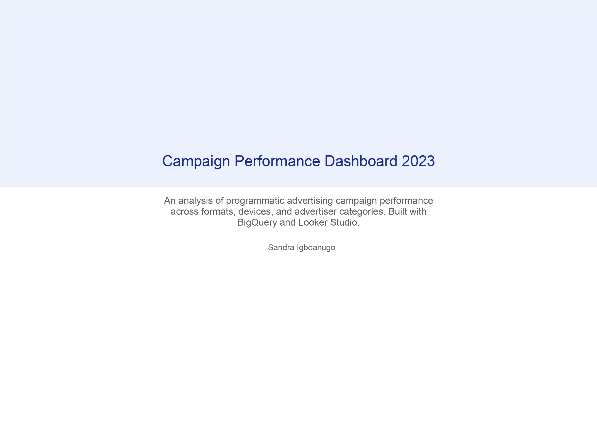
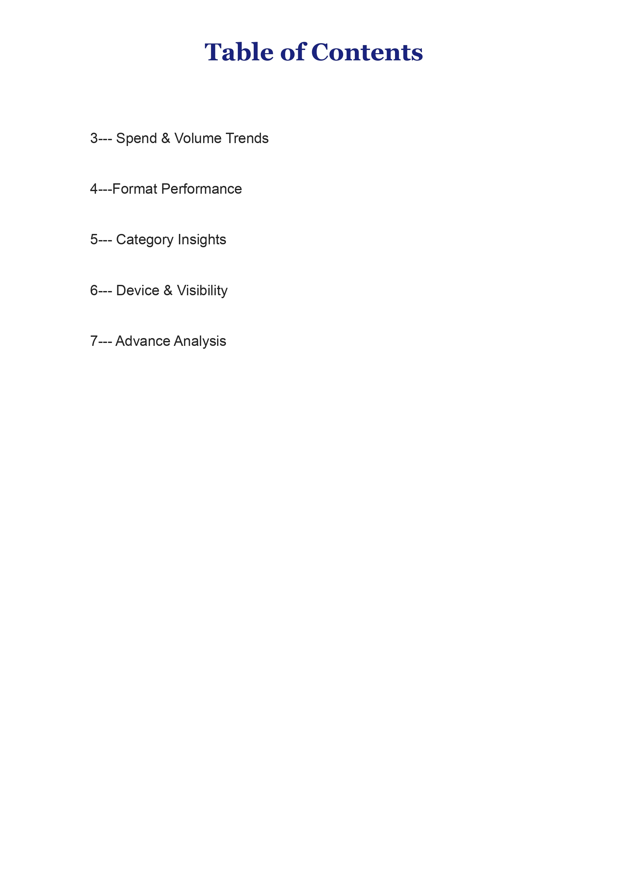
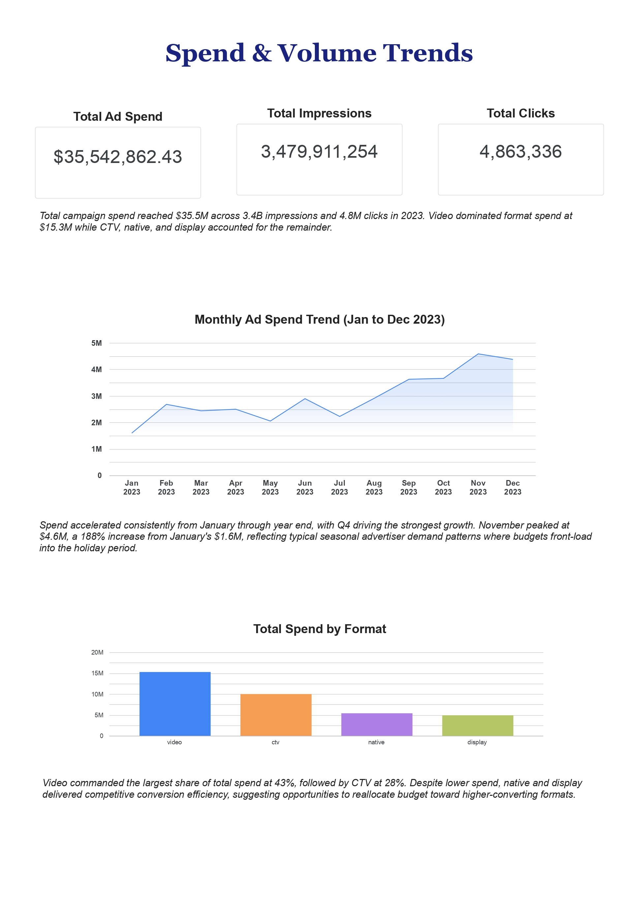
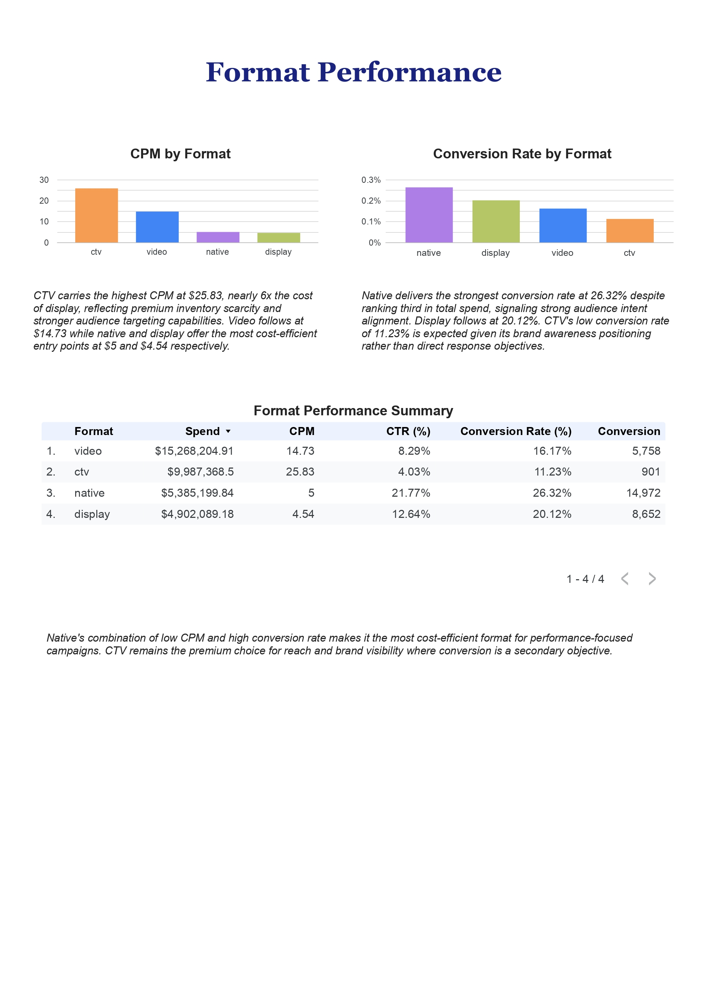
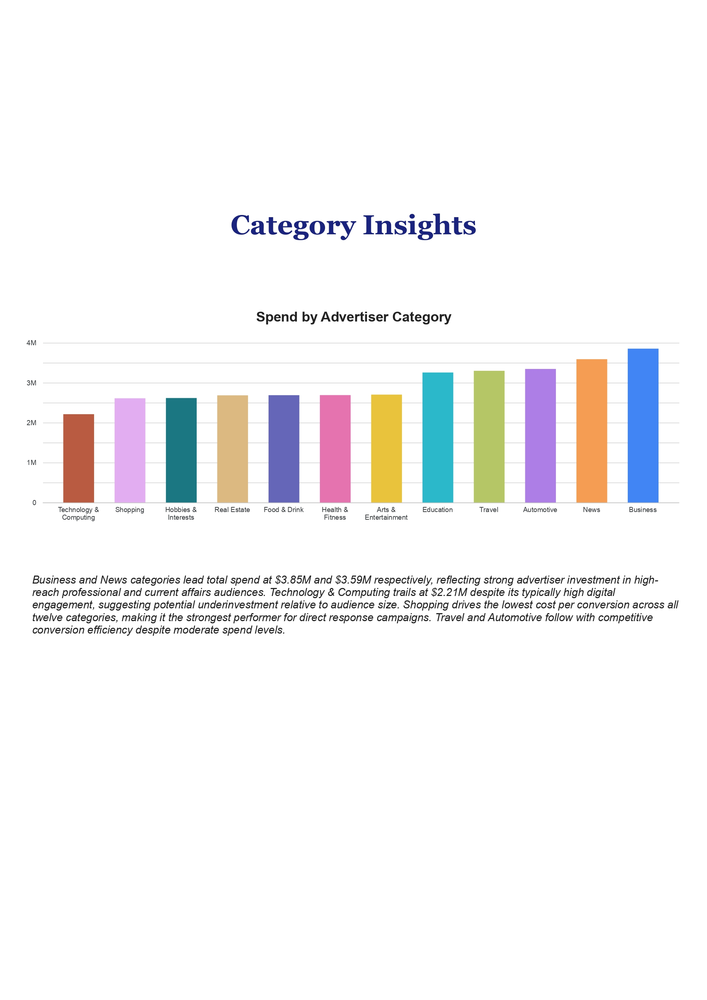
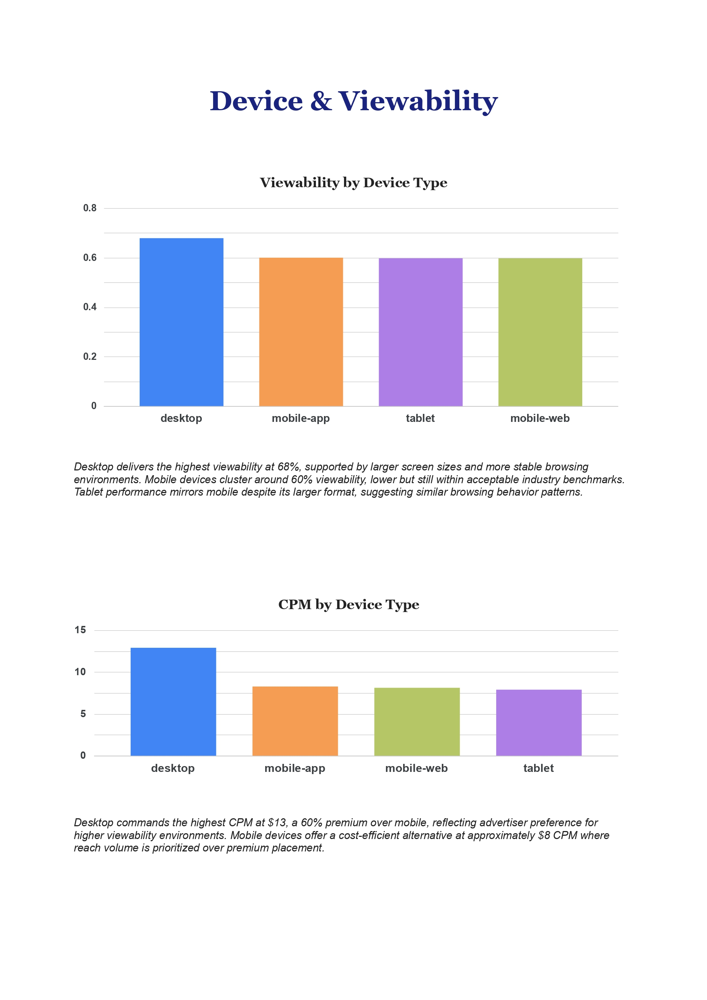

# Adtech Campaign Performance Dashboard 2023

**Tools:** BigQuery · Looker Studio · SQL · Python  
**Dataset:** 20,749 synthetic records modelled on real DSP campaign data  
**Scope:** Spend Analysis · Format Performance · Category Insights · Device & Viewability · Advanced SQL Analysis

---

## Why This Project Exists

Most dashboards answer "what happened." This one is built to answer "why it happened and what to do about it."

Programmatic advertising generates enormous volumes of campaign data — impressions, clicks, spend, conversions — but the value is not in the numbers themselves. It is in understanding which formats drive efficient conversions, which categories are underinvesting relative to their audience size, and where seasonal patterns create predictable budget opportunities. This project was built to demonstrate exactly that kind of analytical thinking: turning raw campaign data into decisions that help companies spend smarter and convert better.

The analysis does not stop at reporting what the data shows. Every chart is paired with a written insight that explains what it means and what a media or BI team should consider doing with that information.

---

## Project Overview

This project simulates the core responsibilities of a BI analyst working within a programmatic advertising environment. Using a synthetic dataset modelled on real DSP campaign data structures, the analysis covers five key reporting domains: spend and volume trends, ad format efficiency, advertiser category performance, device-level viewability, and advanced SQL-driven analysis using CTEs and window functions.

The project was built end-to-end: dataset design and storage in Google BigQuery, SQL querying and transformation, and a six-page interactive dashboard in Looker Studio with written analytical commentary on every page.

---

## Repository Structure

```
adtech-campaign-performance-dashboard/
│
├── adtech_campaign_performance_2023.csv              # Synthetic campaign performance dataset
├── queries.sql                                        # All BigQuery SQL queries with comments
├── Adtech_Campaign_Performance_Dashboard_2023.pdf     # Full dashboard export
├── Adtech_Campaign_Performance_Dashboard_2023_page-1.jpg  # Overview & Table of Contents
├── Adtech_Campaign_Performance_Dashboard_2023_page-2.jpg  # Spend & Volume Trends
├── Adtech_Campaign_Performance_Dashboard_2023_page-3.jpg  # Format Performance
├── Adtech_Campaign_Performance_Dashboard_2023_page-4.jpg  # Category Insights
├── Adtech_Campaign_Performance_Dashboard_2023_page-5.jpg  # Device & Viewability
├── Adtech_Campaign_Performance_Dashboard_2023_page-6.jpg  # Advanced Analysis
└── README.md                                          # Project documentation
```

---

## Dataset Overview

A single campaign performance table was constructed to reflect realistic programmatic advertising data across four ad formats, four device types, twelve advertiser categories, and twenty-one publisher networks spanning January to December 2023.

| Table | Rows | Key Fields |
|---|---|---|
| campaign_performance | 20,749 | month, format, device_type, bid_type, network_id, advertiser_category, spend, impressions, clicks, CPM, CTR, viewability, conversions, video_start, video_complete |

---

## Dashboard Pages

### Page 1 — Overview & Table of Contents



---

### Page 2 — Spend & Volume Trends

Total campaign spend reached $35.5M across 3.4B impressions and 4.8M clicks in 2023. The monthly trend reveals a clear Q4 acceleration — November peaked at $4.6M, a 188% increase from January's $1.6M — consistent with seasonal advertiser demand patterns. Video dominated format spend at $15.3M, but native and display delivered competitive conversion efficiency despite lower investment, signaling opportunities to reallocate budget toward higher-converting formats.



---

### Page 3 — Format Performance

CTV commands the highest CPM at $25.83 — nearly 6x the cost of display — reflecting premium inventory scarcity and stronger audience targeting capabilities. Native delivers the strongest conversion rate at 26.32% despite ranking third in total spend, making it the most cost-efficient format for performance-focused campaigns. CTV's lower conversion rate is expected given its brand awareness positioning rather than direct response objectives.

| Format | Spend | CPM | CTR (%) | Conversion Rate (%) | Conversions |
|---|---|---|---|---|---|
| Video | $15,268,204.91 | 14.73 | 8.29% | 16.17% | 5,758 |
| CTV | $9,987,368.50 | 25.83 | 4.03% | 11.23% | 901 |
| Native | $5,385,199.84 | 5.00 | 21.77% | 26.32% | 14,972 |
| Display | $4,902,089.18 | 4.54 | 12.64% | 20.12% | 8,652 |



---

### Page 4 — Category Insights

Business and News categories lead total spend at $3.85M and $3.59M respectively. Technology & Computing trails at $2.21M despite its typically high digital engagement — a potential underinvestment signal relative to audience size. Shopping drives the lowest cost per conversion across all twelve categories, making it the strongest performer for direct response campaigns. Travel and Automotive follow with competitive conversion efficiency despite moderate spend levels.



---

### Page 5 — Device & Viewability

Desktop delivers the highest viewability at 68% and commands the highest CPM at $13 — a 60% premium over mobile — reflecting advertiser preference for higher viewability environments. Mobile devices cluster around 60% viewability at approximately $8 CPM, offering a cost-efficient alternative where reach volume is prioritized over premium placement. Tablet performance mirrors mobile despite its larger format, suggesting similar browsing behavior patterns.



---

### Page 6 — Advanced Analysis

This page demonstrates advanced SQL techniques applied to real analytical questions. A CTE was used to isolate monthly spend by format, revealing that video consistently led monthly spend across all twelve months, peaking at approximately $2.5M in November. A window function ranked advertiser categories by conversion efficiency within each format, finding that Shopping ranks first across CTV, display, and native — the most consistently high-performing category for direct response campaigns regardless of format. Native amplified this further, with its top five categories all outperforming equivalent CTV rankings.



---

## SQL Queries

All queries are available in `queries.sql`. Below is a summary of each:

**Query 0 — Data Preparation**  
Adds a properly formatted DATE field to enable chronological sorting in Looker Studio.

**Query 1 — Monthly Spend Trend**  
Aggregates total spend, impressions, and clicks by month with blended CPM and CTR.

**Query 2 — Format Performance**  
Compares spend, CPM, CTR, and conversion rate across display, native, video, and CTV formats.

**Query 3 — Advertiser Category Performance**  
Ranks advertiser categories by spend and calculates cost per conversion and conversion efficiency.

**Query 4 — Device Type and Format Efficiency**  
Breaks down viewability, CTR, and CPC by device type and format combination.

**Query 5 — Video Completion Rate**  
Filters to video and CTV formats and calculates VCR by format and device type.

**Query 6 — Cumulative Spend by Format (CTE)**  
Uses a common table expression to calculate monthly spend per format and compute a running cumulative spend across the year, supporting media budget pacing decisions.

**Query 7 — Conversion Efficiency Ranking by Category and Format (Window Function)**  
Uses RANK() partitioned by format to identify which advertiser categories deliver the strongest conversion performance within each format — enabling data-driven budget allocation recommendations.

---

## Key Findings

| # | Finding | Insight |
|---|---|---|
| 1 | Q4 Spend Acceleration | Spend grew 188% from January to November driven by seasonal advertiser demand |
| 2 | Native Conversion Efficiency | Native drives 26.32% conversion rate despite ranking third in total spend |
| 3 | CTV Premium Pricing | CTV CPM of $25.83 is nearly 6x higher than display — premium inventory comes at a cost |
| 4 | Shopping Category Dominance | Shopping ranks first in conversion efficiency across three of four formats |
| 5 | Desktop Viewability Lead | Desktop delivers 68% viewability vs 60% across mobile devices at a 60% CPM premium |

---

## Tools & Technologies

| Tool | Purpose |
|---|---|
| Google BigQuery | Data storage, transformation, and advanced SQL analysis |
| Looker Studio | Six-page interactive dashboard with written analytical commentary |
| SQL | Aggregation, KPI calculation, CTEs, and window functions |
| Python | Synthetic dataset generation |

---

## Skills Demonstrated

- Advanced SQL including CTEs and window functions applied to real business questions
- End-to-end dashboard development from raw data to production-ready analytical report
- KPI framework design across spend, efficiency, engagement, and viewability metrics
- Written analytical commentary translating data into actionable business recommendations
- Synthetic dataset construction modelled on real DSP campaign data structures

---

## About

Data problems worth solving are rarely about reporting what happened. They are about understanding why it happened and what to do next. This project was built with that philosophy — every chart paired with an insight, every insight connected to a decision a real media or BI team would need to make.

**LinkedIn:** [Sandra Igboanugo](https://www.linkedin.com/in/sandraigboanugo/)
